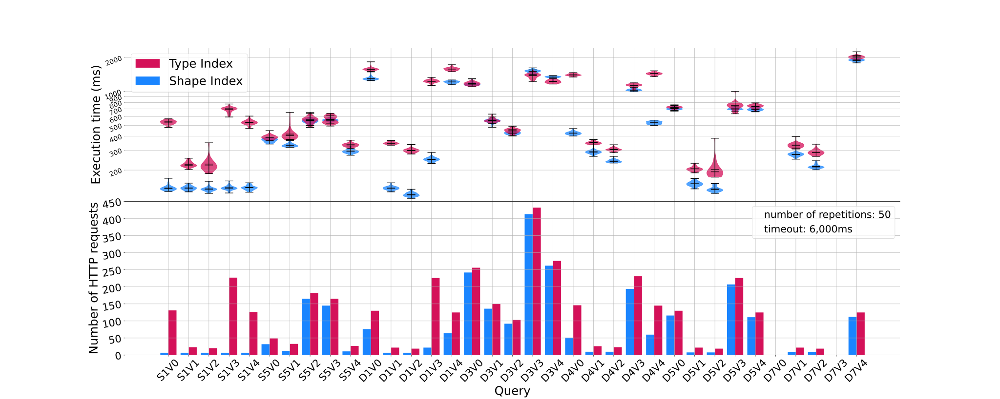

# amw_shape_index_results
A repository for the experiments in relation to the short paper "Opportunities for Shape-based Optimization of Traversal Queries over Decentralized Environments" submitted to the ["Alberto Mendelzon International Workshop on Foundations of Data Management"](https://amw2024.github.io/).

## Dependencies
- Python 3
- Nodejs v18 or higher

## Experiment
The experiment consist of executing a [subset of the queries](client/queries) from the benchmark [Solidbench](https://github.com/SolidBench/SolidBench.js). 
In each pod a complete shape index is added using a custom implementation of a [rdf-dataset-fragmenter.js](https://github.com/constraintAutomaton/rdf-dataset-fragmenter.js/tree/feature/shapeIndex).

Example of a shape index
```turtle
<index1> a si:ShapeIndex ;
  si:domain "http://localhost:3000/pods/00000000000000000065/.*" ;
  si:entry [
    si:bindByShape <http://localhost:3000/pods/00000000000000000065/profile_shape#Profile> ;
    solid:instanceContainer <http://localhost:3000/pods/00000000000000000065/profile/>
  ], [
    si:bindByShape <http://localhost:3000/pods/00000000000000000065/posts_shape#Post> ;
    solid:instanceContainer <http://localhost:3000/pods/00000000000000000065/posts/>
  ] , [
    si:bindByShape <http://localhost:3000/pods/00000000000000000065/comments_shape#Comment> ;
    solid:instanceContainer <http://localhost:3000/pods/00000000000000000065/comments/>
  ] ;
  si:isComplete true .
```
Example of a shape

```turtle
PREFIX xsd: <http://www.w3.org/2001/XMLSchema#>
PREFIX ldbcvoc: <http://localhost:3000/www.ldbc.eu/ldbc_socialnet/1.0/vocabulary/>
PREFIX schema: <http://www.w3.org/2000/01/rdf-schema#>

<http://localhost:3000/pods/00000000000000000065/comments_shape#Comment> CLOSED {
    a ldbcvoc:Comment?;
    ldbcvoc:id xsd:long ;
    ldbcvoc:creationDate xsd:dateTime ;
    ldbcvoc:locationIP xsd:string  ;
    ldbcvoc:browserUsed xsd:string ;
    ldbcvoc:content xsd:string?;
    ldbcvoc:lenght xsd:int ;
    ldbcvoc:hasTag IRI *;
    (
        ldbcvoc:replyOf @<http://localhost:3000/pods/00000000000000000065/comments_shape#Post> *;
        |
        ldbcvoc:replyOf @<http://localhost:3000/pods/00000000000000000065/comments_shape#Comment> *;
    );
    ldbcvoc:isLocatedIn IRI ;
    ldbcvoc:hasCreator @<http://localhost:3000/pods/00000000000000000065/comments_shape#Profile> ;
}
```

To run the experiment two steps are necessary.
- Generate and serve SolidBench
- Run the Comunica client with selected queries

### Generate and serve Solidbench
```
cd ./server
./install
yarn run solidbench-generate
yarn run solidbench-serve
```
This will generate the data and serve an HTTP server hosting the data.

### Run the benchmark

```
cd ./client
./install
yarn run benchmark
```

This will run the benchmark with every selected queries.
The results including the log and the summary of the results will be available in `./client/result`

## Results
An analysis of the results is presented in `./result`.
It is generated using a [jupyter notebook](https://jupyter.org/).
To install all the dependencies inside a virtual the user can run `./create_python_env.sh` and to start the notebook using this environement in the browser `./execute_jupyter.sh`.
Below some important figure are presented.

### Result figure

The query execution time distribution (the upper graph) and the number of HTTP requests (the lower graph).
The results of our approach are in blue and the state of the art (type index with LDP) in red.
The results have been generated with 50 repetitions and a timeout of 6000 ms. 
The queries are denoted with first the initial of the query template (e.g., S1 for interactive-**s**hort-**1**), and the version of the concrete query (e.g., V0).
### Table of performance
Table presenting the percentage of reductions of the shape index approach in relation to the type index approach.SI stand for shape index and TI for type index.

| Query (SI/TI)        | Std execution time   | Percentage of reduction HTTP request   | Percentage of reduction execution time   | Ratio of HTTP request by ratio of execution time   |
|----------------------|----------------------|----------------------------------------|------------------------------------------|----------------------------------------------------|
| complex-8 version 0  | -                    | -                                      | -                                        | -                                                  |
| complex-8 version 1  | -                    | -                                      | -                                        | -                                                  |
| complex-8 version 2  | -                    | -                                      | -                                        | -                                                  |
| complex-8 version 3  | -                    | -                                      | -                                        | -                                                  |
| complex-8 version 4  | -                    | -                                      | -                                        | -                                                  |
| discover-1 version 0 | 48/51                | 42                                     | 17                                       | 0.7                                                |
| discover-1 version 1 | 5/8                  | 68                                     | 60                                       | 0.8                                                |
| discover-1 version 2 | 5/12                 | 63                                     | 60                                       | 0.92                                               |
| discover-1 version 3 | 11/40                | 90                                     | 80                                       | 0.5                                                |
| discover-1 version 4 | 27/47                | 49                                     | 23                                       | 0.66                                               |
| discover-3 version 0 | 40/42                | 5                                      | 1                                        | 0.96                                               |
| discover-3 version 1 | 21/23                | 9                                      | 2                                        | 0.93                                               |
| discover-3 version 2 | 11/20                | 11                                     | 4                                        | 0.93                                               |
| discover-3 version 3 | 48/67                | 4                                      | -9                                       | 0.88                                               |
| discover-3 version 4 | 34/39                | 5                                      | -9                                       | 0.87                                               |
| discover-4 version 0 | 14/29                | 65                                     | 70                                       | 1.17                                               |
| discover-4 version 1 | 14/11                | 62                                     | 17                                       | 0.46                                               |
| discover-4 version 2 | 7/9                  | 57                                     | 21                                       | 0.54                                               |
| discover-4 version 3 | 20/41                | 16                                     | 8                                        | 0.91                                               |
| discover-4 version 4 | 15/38                | 59                                     | 64                                       | 1.14                                               |
| discover-5 version 0 | 18/19                | 11                                     | 2                                        | 0.91                                               |
| discover-5 version 1 | 7/9                  | 64                                     | 26                                       | 0.49                                               |
| discover-5 version 2 | 7/35                 | 58                                     | 33                                       | 0.63                                               |
| discover-5 version 3 | 16/59                | 8                                      | 5                                        | 0.97                                               |
| discover-5 version 4 | 24/27                | 11                                     | 5                                        | 0.94                                               |
| discover-6 version 0 | -                    | -                                      | -                                        | -                                                  |
| discover-6 version 1 | 12/20                | 59                                     | 17                                       | 0.49                                               |
| discover-6 version 2 | 9/15                 | 53                                     | 27                                       | 0.64                                               |
| discover-6 version 3 | -                    | -                                      | -                                        | -                                                  |
| discover-6 version 4 | 40/68                | 10                                     | -1                                       | 0.89                                               |
| discover-7 version 0 | -                    | -                                      | -                                        | -                                                  |
| discover-7 version 1 | 11/16                | 59                                     | 17                                       | 0.49                                               |
| discover-7 version 2 | 9/15                 | 53                                     | 25                                       | 0.63                                               |
| discover-7 version 3 | -                    | -                                      | -                                        | -                                                  |
| discover-7 version 4 | 50/60                | 10                                     | 6                                        | 0.96                                               |
| short-1 version 0    | 7/23                 | 95                                     | 74                                       | 0.19                                               |
| short-1 version 1    | 5/12                 | 70                                     | 38                                       | 0.48                                               |
| short-1 version 2    | 7/30                 | 65                                     | 40                                       | 0.58                                               |
| short-1 version 3    | 6/36                 | 97                                     | 80                                       | 0.15                                               |
| short-1 version 4    | 6/25                 | 94                                     | 74                                       | 0.23                                               |
| short-5 version 0    | 14/16                | 35                                     | 6                                        | 0.69                                               |
| short-5 version 1    | 11/52                | 64                                     | 20                                       | 0.45                                               |
| short-5 version 2    | 27/37                | 9                                      | 1                                        | 0.92                                               |
| short-5 version 3    | 18/40                | 12                                     | 1                                        | 0.89                                               |
| short-5 version 4    | 12/12                | 59                                     | 12                                       | 0.47                                               |

### Table of statistical significance

Table presenting the statistical significance of the results. SI stand for shape index and TI for type index.

| Query                 | SI faster query execution   | P value   | SI different execution time than TI   | P value   |
|-----------------------|-----------------------------|-----------|---------------------------------------|-----------|
| complex-8 version v0  | -                           | -         | -                                     | -         |
| complex-8 version v1  | -                           | -         | -                                     | -         |
| complex-8 version v2  | -                           | -         | -                                     | -         |
| complex-8 version v3  | -                           | -         | -                                     | -         |
| complex-8 version v4  | -                           | -         | -                                     | -         |
| discover-1 version v0 | True                        | 1.57e-28  | True                                  | 3.14e-28  |
| discover-1 version v1 | True                        | 3.93e-29  | True                                  | 7.85e-29  |
| discover-1 version v2 | True                        | 3.93e-29  | True                                  | 7.85e-29  |
| discover-1 version v3 | True                        | 3.93e-29  | True                                  | 7.85e-29  |
| discover-1 version v4 | True                        | 3.93e-29  | True                                  | 7.85e-29  |
| discover-3 version v0 | False                       | 1.09e-01  | False                                 | 2.17e-01  |
| discover-3 version v1 | False                       | 6.62e-02  | False                                 | 1.32e-01  |
| discover-3 version v2 | True                        | 4.23e-08  | True                                  | 8.46e-08  |
| discover-3 version v3 | False                       | 1.00e+00  | True                                  | 8.28e-18  |
| discover-3 version v4 | False                       | 1.00e+00  | True                                  | 4.82e-21  |
| discover-4 version v0 | True                        | 3.93e-29  | True                                  | 7.85e-29  |
| discover-4 version v1 | True                        | 1.77e-23  | True                                  | 3.54e-23  |
| discover-4 version v2 | True                        | 3.93e-29  | True                                  | 7.85e-29  |
| discover-4 version v3 | True                        | 1.88e-19  | True                                  | 3.76e-19  |
| discover-4 version v4 | True                        | 3.93e-29  | True                                  | 7.85e-29  |
| discover-5 version v0 | True                        | 1.90e-05  | True                                  | 3.80e-05  |
| discover-5 version v1 | True                        | 3.93e-29  | True                                  | 7.85e-29  |
| discover-5 version v2 | True                        | 3.93e-29  | True                                  | 7.85e-29  |
| discover-5 version v3 | True                        | 1.89e-07  | True                                  | 3.77e-07  |
| discover-5 version v4 | True                        | 5.69e-12  | True                                  | 1.14e-11  |
| discover-6 version v0 | -                           | -         | -                                     | -         |
| discover-6 version v1 | True                        | 5.46e-27  | True                                  | 1.09e-26  |
| discover-6 version v2 | True                        | 3.93e-29  | True                                  | 7.85e-29  |
| discover-6 version v3 | -                           | -         | -                                     | -         |
| discover-6 version v4 | False                       | 9.97e-01  | False                                 | 6.27e-03  |
| discover-7 version v0 | -                           | -         | -                                     | -         |
| discover-7 version v1 | True                        | 4.71e-28  | True                                  | 9.42e-28  |
| discover-7 version v2 | True                        | 3.93e-29  | True                                  | 7.85e-29  |
| discover-7 version v3 | -                           | -         | -                                     | -         |
| discover-7 version v4 | True                        | 9.23e-19  | True                                  | 1.85e-18  |
| short-1 version v0    | True                        | 3.93e-29  | True                                  | 7.85e-29  |
| short-1 version v1    | True                        | 3.93e-29  | True                                  | 7.85e-29  |
| short-1 version v2    | True                        | 3.93e-29  | True                                  | 7.85e-29  |
| short-1 version v3    | True                        | 3.93e-29  | True                                  | 7.85e-29  |
| short-1 version v4    | True                        | 3.93e-29  | True                                  | 7.85e-29  |
| short-5 version v0    | True                        | 5.00e-12  | True                                  | 1.00e-11  |
| short-5 version v1    | True                        | 3.93e-29  | True                                  | 7.85e-29  |
| short-5 version v2    | False                       | 4.75e-02  | False                                 | 9.51e-02  |
| short-5 version v3    | False                       | 5.84e-01  | False                                 | 8.37e-01  |
| short-5 version v4    | True                        | 3.89e-24  | True                                  | 7.78e-24  |
